# Harness concept map

_Updated 2026-06-18 (reflects axe-promotion + checker-uncertainty routing, commits `5dd67a8` / `7e7a3e3`)._

The paper-quality figure is [`figures/harness-architecture.svg`](figures/harness-architecture.svg)
(raster: [`figures/harness-architecture.png`](figures/harness-architecture.png)). The Mermaid below is the
editable source of the same architecture.

**Colour legend:** 🔵 obligation ledger / anchoring · 🟢 deterministic, decides · 🟡 LLM, non-authoritative ·
🔴 reconciliation · 🟣 trust & calibration · ⚪ evidence & integrity.

---

## Architecture — collect → enumerate → measure → reconcile → publish

```mermaid
flowchart TB
  classDef anchor fill:#e7eef8,stroke:#3f5e93,color:#1f2933;
  classDef det  fill:#e6f1e8,stroke:#3f7d51,color:#1f2933;
  classDef evid fill:#eaf1f0,stroke:#4f8088,color:#1f2933;
  classDef llm  fill:#fbf3df,stroke:#b07e1f,color:#1f2933;
  classDef led  fill:#f8eae7,stroke:#a9504a,color:#1f2933;
  classDef trust fill:#efe9f6,stroke:#6f4f9c,color:#1f2933;
  classDef neutral fill:#eef1f4,stroke:#8a98a6,color:#1f2933;

  SAVED["Frozen page snapshot — the saved dataset every lane runs over;<br/>ground truth is hand-labeled afterward"]:::neutral
  COL["<b>Collector</b> — static facts: DOM, accessibility tree, and an axe pass,<br/>each stamped with a run-id and a digest of the page source"]:::neutral

  OBL["<b>Obligation enumeration — applicability oracle</b><br/>Every (element × criterion × claim-family) becomes one atomic obligation,<br/>derived independently of the candidate generators, so a forgotten branch surfaces<br/>as an auto-PARTIAL rather than a silent pass. Default-closed: one disposition each."]:::anchor

  RUN["<b>Behavioral runners (×10) — they DECIDE</b><br/>Drive the live page to settle the criteria static scanners cannot reach:<br/>focus visibility (2.4.7), keyboard operability &amp; traps (2.1.1/2.1.2),<br/>status messages (4.1.3), reflow (1.4.10), hover (1.4.13), invalid-submit (3.3.1).<br/>Typed directional support — a clear needs strictly more evidence than a barrier."]:::det

  EVID["<b>Instruments &amp; checkers — evidence, never verdicts</b><br/>Vision + before/after state pairs · virtual screen reader with CDP name correction ·<br/>keyboard &amp; reading-order graphs (BAGEL/LOTUS) · status &amp; OCR probes ·<br/>axe + IBM as deterministic cross-signals"]:::evid

  LLM["<b>LLM judge — non-authoritative</b><br/>Reasons over the frozen evidence plus a bounded set of read-only / fresh-clone<br/>CDP tools that return objective measurements only; fills nothing the deterministic<br/>lane already decided. Capped at canary by construction — never authoritative."]:::llm

  LEDGER["<b>Obligation ledger — one disposition per obligation</b><br/>Precedence CLAIM ▸ PROVISIONAL ▸ PARTIAL. Runner CLAIMs are authoritative-capable;<br/>everything else may only fill what the deterministic lane left at auto-PARTIAL."]:::led

  PROV["<b>Provisional fills — non-authoritative</b><br/>Barrier-dominates-clear; never override a CLAIM. Three sources:<br/>the LLM verdict, axe-promotion (axe's decided violations on its closed sub-domains),<br/>and keyboard-trap promotion."]:::llm

  AUTH["<b>Authority gate — default shadow → canary → authoritative</b><br/>Behavioral runners reach authoritative once gold-calibrated;<br/>the LLM and all promotions are capped at canary."]:::trust

  GOLD["<b>Calibration (offline)</b> — gold set hand-labeled AFTER the run.<br/>A mechanism reaches canary only with zero false clears over ≥149 labelled clears<br/>(false-barrier ≤10%, coverage ≥50%)."]:::trust

  CLAIMS["<b>Authoritative claims</b> — published"]:::det
  SHADOW["<b>Shadow / provisional annotations</b> — recorded, never published, scored offline"]:::neutral

  SAVED --> COL --> OBL
  OBL -->|"per obligation"| RUN
  OBL -->|"per auto-PARTIAL"| LLM
  EVID -->|evidence| LLM
  EVID -. "INCOMPLETE ⇒ new obligation + judge hint (absence ≠ pass)" .-> OBL
  RUN ==>|authoritative CLAIM| LEDGER
  EVID -. "axe / trap promotions" .-> PROV
  LLM -. fill .-> PROV
  PROV -. "fills auto-PARTIAL" .-> LEDGER
  LEDGER --> AUTH
  PROV -. capped .-> AUTH
  AUTH ==> CLAIMS
  AUTH -. capped .-> SHADOW
  SHADOW -. scored .-> GOLD -. "gates promotion" .-> AUTH
```



---

### What changed in this revision

- **axe-promotion** — axe's *decided* violations on its closed deterministic sub-domains
  (button-name → 4.1.2, image-alt → 1.1.1, link-name → 2.4.4, link-in-text-block → 1.4.1,
  document-title → 2.4.2) now land as a **PROVISIONAL barrier** on the matching obligation, *route-by-facet*
  (axe fills where no behavioral runner decides, and defers where one does). Still non-authoritative —
  it can lift coverage but never false-clear/false-barrier conformance.
- **keyboard-trap promotion** — the 2.1.2 trap detector's barrier joins the same provisional fill path,
  making the provisional tier a **three-source** fill (LLM · axe · trap), all tie-broken barrier-dominates-clear.
- **checker-uncertainty routing** — a checker `incomplete` / needs-review finding is now a first-class reason to
  **enumerate an obligation** and route it to the LLM with the checker's reason attached ("absence ≠ pass"),
  rather than being discarded as "no violation."

### Editorial note

Earlier revisions of this map carried a term-salad "anchored by SC · skill · category · bucket · direction"
node and a flat taxonomy list. Those are dropped here: concepts the figure does not *use to tell the story*
(finding categories cat_1–9, selection levels, budgets, the verdict enum) live in the prose glossary, not on
the diagram. Each box that remains carries a real description rather than a label dump. For the full inventory
with file anchors, see the conversation glossary / the per-subsystem docs under [`docs/analysis/`](analysis/).
```
